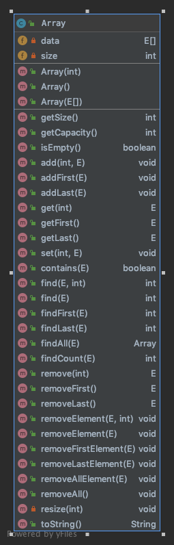

# Array

> 数组是n个**相同类型**的数据的有序集合(n >= 0)

### 特点

-   **线性**结构
-   顺序存储结构(**连续**的内存单元)
    (所以在声明数组的时候一般要指定**容量**和**数据类型**, 为了开辟内存空间)

>   这样在数组中查找元素的时候就可以通过首地址+偏移量(索引 * 数据类型大小)来快速计算出元素地址，定位元素。

### 优势

-   快速查找

### 劣势

-   增加/删除元素慢

### 最适合的应用场景

-   索引最好有语义

    -   索引表示顺序(第几名...)
    -   索引连续(👆的列子不会出现1-200名这样大范围内的数据不存在)

-   只在数组尾部增加/删除元素
    
    -   循环队列(TODO)

### 基于JAVA的Array类实现

-   目标

    -   基于JAVA提供的**静态**数组
    -   动态扩/缩容
        (缩容的时候要慎重选择临界值，防止缩容后马上扩容的情况频繁触发)
    -   提供一些基本方法

### UML

### Code

[我的实现](https://github.com/caliburex/DataStructure/blob/master/Array/src/Array.java)

### 复杂度分析

-   时间复杂度
    - resize **O(1)**
        在👆的实现中，并不是每次都会增/删元素都会触发resize。
        以增加元素为例子
        对于一个容量为n，大小为0的数组来说
        当添加了n+1个数据时，才会发生一次的resize
        **resize_count = n;
        addLast_count = n + 1;**
        所以其**O(n) = (2n + 1) / (n + 1) = O(1)**
        👆的复杂度计算称为均摊时间复杂度

-   空间复杂度

    - findAll **O(n)**

### Tips

removeAllElement方法循环一次，计算未删除元素的偏移量。
remove操作要释放内存空间
当size = capacity的时候进行扩容，当size = capacity / 4 的时候进行缩容，这是为了**防止缩容后马上扩容的情况频繁触发**

 

>   内容来源：[玩转算法系列--玩转数据结构 更适合0算法基础入门到进阶（java版）](https://coding.imooc.com/class/207.html)

